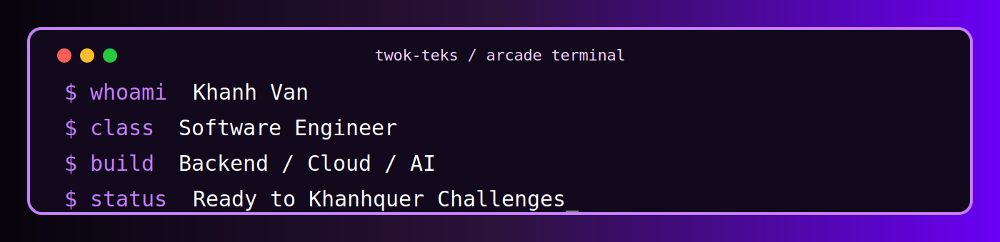

# Khanh Van
### `Software Engineer`

---

## 👾 ABOUT ME 👾

I’m a software engineer who enjoys building reliable systems, deploying practical applications, and learning deeply enough to understand how things work under the hood. My work and projects span backend development, cloud deployment, CI/CD, full-stack applications, and machine learning.

I’m especially interested in clean system design, engineering workflows, practical AI, and building software that is both useful and thoughtfully made.

---

## 🕹 SELECT A PROJECT

<table>
  <tr>
    <td align="center">
      
    </td>
    <td align="center">
      
    </td>
    <td align="center">
      
    </td>
  </tr>
  <tr>
    <td align="center">
      
    </td>
    <td align="center">
      
    </td>
    <td align="center">
      
    </td>
  </tr>
</table>

---

## 🚀 CURRENT QUESTS

- ☁️ Growing deeper in **AWS, deployment, and cloud architecture**
- ⚙️ Building stronger **backend engineering** foundations
- 🔄 Improving **CI/CD and DevOps workflows**
- 🤖 Exploring practical **AI/ML systems**
- 📚 Pushing toward long-term growth in advanced engineering and research

---

## 🌳 TECH SKILL TREE

### Languages

### Frameworks

### Cloud / DevOps

### Databases / Tools

---

## 🍂 FALL FOLIAGE ML SYSTEM

A machine learning project built to predict annual fall foliage patterns using historical foliage behavior and weather-related data. This project involved learning the end-to-end ML process from scratch: data collection, preprocessing, model training, evaluation, and deployment.

**Stack:** `Python` `Scikit-Learn` `Pandas` `Flask` `AWS EC2`

<b>Open project details</b>

 

- Built predictive workflows around weather and seasonal trends
- Processed data and trained models using Python-based ML tooling
- Created a Flask web application to serve predictions
- Deployed the application to AWS EC2
- Connected ML logic to a usable user-facing interface

---

## 🥘 INGREDIENCE

A kitchen inventory and recipe-generation platform designed to help users track ingredients, monitor expiration dates, identify low-stock items, and generate shopping lists and recipe suggestions based on available ingredients.

**Stack:** `React` `Node.js` `MongoDB` `JavaScript`

<b>Open project details</b>

 

- Built inventory tracking features for kitchen organization
- Included expiration awareness and low-stock monitoring
- Designed recipe-generation flows around available ingredients
- Planned convenience features like barcode-supported item entry
- Focused on practicality and real daily-use value

---

## 🏠 QHUNG MANAGEMENT PORTAL

A responsive property management system for tenant workflows, portal access, operational efficiency, and online management features.

**Stack:** `Java` `Spring Boot` `PostgreSQL` `AWS`

<b>Open project details</b>

 

- Built and deployed a full website for QHung Management
- Supported tenant application and workflow management
- Improved communication and data organization
- Used Spring Boot for backend structure and AWS for deployment
- Focused on real-world usability and business needs

---

## 📈 BOTSTONKWAR

A collaborative engineering project involving stock-focused workflows, backend experimentation, system logic, and CI/CD-oriented thinking.

**Stack:** `Python` `Flask` `Next.js` `Docker` `Kubernetes` `MySQL`

<b>Open project details</b>

 

- Worked on backend-driven application architecture
- Explored collaborative engineering workflows
- Used containerization and deployment-related tooling
- Focused on system behavior, logic, and engineering process
- Combined experimentation with practical software structure

---

## 🤖 AI RESEARCH ZONE

I’m interested in AI/ML systems that go beyond just using models as black boxes. I care about understanding *why* a model makes certain decisions, how internal behavior emerges, and where reliability breaks down.

### Current research interests
- Hallucination behavior in large language models
- Layer-wise decision pathways in transformer models
- Interpretable AI and reasoning analysis
- Practical ML systems that bridge engineering and research

### Example direction I’m exploring
**Understanding when and how hallucinated predictions form inside LLMs by analyzing internal layer behavior and decision pathways.**

<b>Open research notes</b>

 

I’m particularly drawn to research that connects theory with implementation. That means not only training or using models, but also studying their internal mechanics, failure patterns, and reliability under real conditions.

My long-term interests include:
- explainability and interpretability
- trustworthy AI
- model behavior analysis
- engineering systems that support research-scale experimentation

---

## 📊 SYSTEM METRICS

  

---

## ⚡ ACTIVITY GRID

  

---

## 🐍 CONTRIBUTION SNAKE

  

---

## 🌿 SIDE QUESTS

- 🌎 Traveling and exploring new places
- 🌄 Nature, hiking, and outdoors
- 🎮 Retro aesthetics and creative interfaces
- 🎨 Designing projects with personality
- 🧠 Learning new technical concepts deeply

---

## 📡 CONTACT TERMINAL

---

### 👾 READY TO KHANHQUER CHALLENGES

